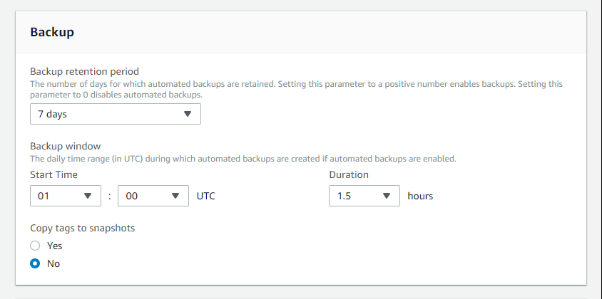

Ok, già tutti voi conoscete le prodezze del cloud di Amazon, per cui non vi annoio con i dettagli, e se i vostri server si trovano su AWS è molto facile che già utilizziate il loro *db engine as a service*, ovvero **RDS** (che sta per Relational Database Service).

*Repost di articolo apparso per la prima volta su [Medium](https://medium.com/@simmessa/fare-un-dump-da-uno-snapshot-rds-con-python-e-terraform-7cbd0fa026fc)*

Oggi parliamo proprio di un hack utile per chi usa questo servizio, e nello specifico, andremo a vedere come creare un classico dump del db (formato .sql) da un'istanza di database.

## Ma non esistono già i backup?

RDS, tra le tante cose interessanti, offre la funzionalità di avere dei backup automatici, ed se lo avete provato sapete già che è davvero comodo. In ogni momento potete ripristinare uno snapshot esistente o anche creare una nuova istanza del database, di cui scegliere la dimensione (intesa come "potenza" del server), andando a pescare dai dati dello snapshot.


*RDS ha degli ottimi backup, ma non sono i dump sql che servono a noi…*

Spesso mi è capitato di pensare che questi backup fossero già quello che mi serviva, ovvero un modo come un altro di dumpare il db in file sql compresso per duplicare un servizio, purtroppo mi sono accorto a mie spese che non è così semplice, soprattutto se vi va di automatizzare il processo e volete trovare il modo di rischiare il meno possibile con un db live in produzione.

Il succo del discorso è che, su RDS, è estremamente facile duplicare un database tramite snapshot e creando una nuova istanza, ma il livello di portabilità di questo genere di "dump" è praticamente nullo, vale solo su RDS.

Al contrario, se volete ottenere un dump non è così banale.

## Il metodo basic

Il processo è abbastanza semplice:

- Creiamo uno snapshot
- Lanciamo una nuova istanza di db "piccola" a piacere (ad esempio una db.t2.micro, con 1 vCPU e 1 Gb di RAM) selezionando come source lo snapshot che ci interessa
- Ci colleghiamo via **mysqldump** alla nuova istanza e produciamo il dump del database che ci serve

Farlo manualmente ogni volta, però, lo trovo pallosetto, per cui ho cercato (grazie Google!) ed elaborato un metodo più furbo ed automatico di farlo

## Alcune accortezze LIVE

Se per caso volete avere il dump di un database di produzione e volete evitare problemi, accontentandovi anche di dati non freschissimi, vi consiglio per cominciare di impostare i job di backup / creazione degli snapshot nella fascia dove avete meno accessi al vostro servzio, potrebbe essere in fascia notturna, ma sta a voi scoprirlo e, in ogni caso, se è un servizio pubblico Google Analytics è vostro amico, altrimenti buona ricerca nei log.

## Il metodo Terraform + Python script

Premetto che trovate il codice di esempio di questo articolo sul mio profilo [github](https://github.com/simmessa/rds_snaptodump), e ora andiamo a vedere con ordine cosa dobbiamo fare per andare a creare il dump in questo modo.

Prima di proseguire clonate il repo ed entrateci con:

```
$ git clone https://github.com/simmessa/rds_snaptodump
cd rds_snaptodump
```

### Prerequisiti vari

Per eseguire i file del repository vi serve:

- terraform (per l'installazione vedete qui sotto)
- mysqldump
- un account AWS con i privilegi necessari per interagire con RDS (lettura, list dei database, ecc) (altre informazioni qui sotto)
- python 2 (ho testato con la versione 2.7.12)

### Installare Terraform

Per prima cosa vi consiglio di installare [Terraform](https://www.terraform.io), è un tool fatto dai simpatici signori di [Hashicorp](https://www.hashicorp.com/) che è molto utile e vi aprirà un mondo sul modo di creare infrastrutture in cloud da riga di comando, ma, ovviamente, lo scope di questo articolo non ci consente di approfondire l'argomento.

Sappiate almeno che, con terraform, potrete lanciare comandi che andranno a definire, in base a degli script, ambienti in cloud su AWS, GKE o altro.

Non ho idea se Terraform sia in bundle grazie al pkg manager della vostra distro Linux preferita (o magari su [WSL](https://medium.com/@simmessa/installare-un-ambiente-di-sviluppo-linux-su-windows-10-wsl-fc638bb4ff8e) sotto windows 10), ma per installarlo da riga di comando la procedura è molto semplice, andate [qui](https://www.terraform.io/downloads.html), scaricatevi il binario adeguato e poi unzippatelo:

```
$ wget https://releases.hashicorp.com/terraform/0.11.10/terraform_0.11.10_linux_amd64.zip; unzip terraform_0.11.10_linux_amd64.zip
```

Ottimo a questo punto vi dovreste trovare con il binario di terraform dentro il repository github precedentemente clonato.

Per verificare l'install di terraform non vi resta che provare ad eseguire terraform:

```
./terraform
Usage: terraform [-version] [-help] <command> [args]

The available commands for execution are listed below.
The most common, useful commands are shown first, followed by
less common or more advanced commands. If you're just getting
started with Terraform, stick with the common commands. For the
other commands, please read the help and docs before usage.

Common commands:
    apply              Builds or changes infrastructure
    console            Interactive console for Terraform interpolations
    destroy            Destroy Terraform-managed infrastructure
    env                Workspace management
    fmt                Rewrites config files to canonical format
    get                Download and install modules for the configuration
    graph              Create a visual graph of Terraform resources
    import             Import existing infrastructure into Terraform
    init               Initialize a Terraform working directory
    output             Read an output from a state file
    plan               Generate and show an execution plan
    providers          Prints a tree of the providers used in the configuration
    push               Upload this Terraform module to Atlas to run
    refresh            Update local state file against real resources
    show               Inspect Terraform state or plan
    taint              Manually mark a resource for recreation
    untaint            Manually unmark a resource as tainted
    validate           Validates the Terraform files
    version            Prints the Terraform version
    workspace          Workspace management

All other commands:
    debug              Debug output management (experimental)
    force-unlock       Manually unlock the terraform state
    state              Advanced state management
```

Se l'output è come quello che vedete qui sopra siete a posto, terraform è pronto per essere usato.

### Editare lo script main.tf

Ora che avete Terraform a disposizione dovrete editare lo script che useremo per creare l'istanza del nostro database di cui ottenere il dump.

Si chiama main.tf e lo trovate qui sotto:

```
provider "aws" {
  region = "eu-west-1" # put your AWS region here!
}

# Get latest snapshot from production DB
data "aws_db_snapshot" "latest_prod_snapshot" {
    most_recent = true
    db_instance_identifier = "mydbname" # put the name of your db here!
}
# Create new staging DB
resource "aws_db_instance" "db_snapshot_dumper" {
  instance_class       = "db.t2.micro"
  identifier           = "db-snapshot-dumper"
  username             = "user" # necessary, but won't be used since a snapshot identifier is provided...
  password             = "password" # necessary, but won't be used since a snapshot identifier is provided...
  snapshot_identifier  = "${data.aws_db_snapshot.latest_prod_snapshot.id}"
  #vpc_security_group_ids = ["sg-12345678"] # if you are running inside a VPC uncomment and put yours here
  skip_final_snapshot = true # Won't produce a final snapshot when disposing of db
}

output "address" {
  value = "${aws_db_instance.db_snapshot_dumper.address}"
}

output "snapshot" {
  value = "${aws_db_instance.db_snapshot_dumper.snapshot_identifier}"
}
```

Ci sono varie cose che dovrete cambiare per adattarle al vostro caso specifico, come la regione AWS in cui usate il servizio RDS:

```
provider "aws" {
  region = "eu-west-1" # put your AWS region here!
}
[...]
```

e l'identificativo del vostro database, come risulta dal pannello di RDS:

```
[...]
# Get latest snapshot from production DB
data "aws_db_snapshot" "latest_prod_snapshot" {
    most_recent = true
    db_instance_identifier = "mydbname" # put the name of your db here!
}
[...]
```

Infine, se la vostra infrastruttura sul cloud prevede una vpc, vi consiglio di decommentare l'apposita riga e di inserire l'id della vostra vpc:

```
[...]
  #vpc_security_group_ids = ["sg-12345678"] # if you are running inside a VPC uncomment and put yours here
[...]
```

Vorrei cogliere l'occasione per farvi notare che non abbiamo dovuto dare a Terraform l'id di uno snapshot specifico, al contrario, gli abbiamo chiesto di usare l'ultimo a disposizione (most_recent = true):

```
[...]
# Get latest snapshot from production DB
data "aws_db_snapshot" "latest_prod_snapshot" {
    most_recent = true
    db_instance_identifier = "mydbname" # put the name of your db here!
}
[...]
```

Lo trovo fantastico, per i miei scopi, ma se per caso avete bisogno di uno snapshot specifico,  vi rimando all'ottima [documentazione di Terraform](https://www.terraform.io/docs/providers/aws/d/db_snapshot.html) per i dettagli.

Una volta fatte queste operazioni possiamo passare a modificare la parte Python del nostro dumper.

### Editare lo script Python snaptodump.py

Lo script "snaptodump.py" nella sua forma "originale" lo trovate qui sotto:

```
#Python

from sys import argv
from datetime import datetime

import sys, os, os.path

start_time = datetime.now()

# MySQL setup: put the MySQL user with dump permission and database name here
# password will be asked interactively later: 

dbusr = "your_mysql_username" 
dbname = "your_mysql_database_name"

print """

This script will launch Terraform to dump the latest snapshot of prod db

PREREQUISITES:

You need AWS tokens setup as ENV vars or Terraform won't work:
export AWS_ACCESS_KEY_ID="xxx"
export AWS_SECRET_ACCESS_KEY="yyy"

USAGE:

python snaptodump.py

*** WARNING ***
This tool requires the mysqldump binary installed on your system and the necessary free space on your local disk for dumping!

"""

terraform_init_dir = "./.terraform"

if os.path.exists(terraform_init_dir):
    print "terraform init already ran!\n"
else:
    os.system( "./terraform init")

if ( os.system( "./terraform apply") != 0 ):
    print "*** ERROR while applying terraform config, dumping stopped! ***"
    exit()

host = os.popen('./terraform output address').read()
filename = os.popen('./terraform output snapshot').read() + ".sql.gz"

dumpcmd = "mysqldump -h %s -u %s --compress -p %s |gzip > %s" % (host.replace('\n',''), dbusr, dbname, filename.replace('\n',''))

print "Next step is mysqldump, you will be asked for a MySQL password\n"

dbdump_start = datetime.now()

if os.system( dumpcmd ):
    print "An error occurred!"
    print "command was: %s" % dumpcmd
else:
    print "All done!"
    print "Db dumped in %s" % ( datetime.now() - dbdump_start )

#Now let's destroy our temp RDS instance
os.system( "./terraform destroy ")

#Feeling bold? comment previous command and enable this!
#os.system( "./terraform destroy -auto-approve"

print "Total procedure completed in %s\n" % ( datetime.now() - start_time )

#print dumpcmd
```

Dovrete modificare alcune variabili per farlo girare sulle vostre istanze di db, prima di tutto, è necessario inserire user e nome del database mysql che volete dumpare:

```
[...]
dbusr = "your_mysql_username" 
dbname = "your_mysql_database_name"
[...]
```

diventerà, ad esempio:

```
[...]
dbusr = "pippo" 
dbname = "dbproduzione"
[...]
```

A questo punto, se provate a lanciare lo script:

```
$ python snaptodump.py
```

Vi accorgerete che, per funzionare, necessita della parte di autenticazione AWS, senza di cui Terraform non può dialogare con AWS.

### Autenticazione e chiavi di accesso AWS

Per poter interagire con il cloud AWS vi serve definire due variabili di sistema, contenenti le vostre credenziali con cui configurare RDS:

```
export AWS_ACCESS_KEY_ID="xxx"
export AWS_SECRET_ACCESS_KEY="yyy"
```

**ATTENZIONE: Non fate girare lo script utilizzando credenziali con tutti i permessi (come il root account) o comunque con credenziali superiori a quelle strettamente necessarie per fare il dump di database RDS**

Facendo girare Terraform con tutti i privilegi AWS potreste letteramente cancellarvi il vostro ambiente in cloud, per cui ho pensato di mettere l'avviso qui sopra.

A questo titolo, visto che ci ho perso un po' di tempo, mi sembra opportuno definire quali siano questi permessi di AWS IAM necessari all'esecuzione del dump, vediamoli assieme.

Prima di tutto ho creato un utente e un gruppo appositi, i permessi necessari sono ovviamente definiti all'interno del gruppo, per poterli applicare più velocemente ad un eventuale nuovo utente futuro.

Definito il gruppo "db_dumpers", ho poi creato le policy necessarie ad interagire con RDS, e sono due.

La prima, fa parte delle policy pre-configurate di AmazonRDS, e si chiama:

"AmazonRDSReadOnlyAccess"

in json, il contenuto è questo:

```
{
  "Version": "2012-10-17",
  "Statement": [
    {
      "Action": [
        "rds:Describe*",
        "rds:ListTagsForResource",
        "ec2:DescribeAccountAttributes",
        "ec2:DescribeAvailabilityZones",
        "ec2:DescribeInternetGateways",
        "ec2:DescribeSecurityGroups",
        "ec2:DescribeSubnets",
        "ec2:DescribeVpcAttribute",
        "ec2:DescribeVpcs"
      ],
      "Effect": "Allow",
      "Resource": "*"
    },
    {
      "Action": [
        "cloudwatch:GetMetricStatistics",
        "logs:DescribeLogStreams",
        "logs:GetLogEvents"
      ],
      "Effect": "Allow",
      "Resource": "*"
    }
  ]
}
```

Come potete vedere, oltre a RDS contiene alcuni privilegi utili per ec2, tra cui sottoreti, security group e VPC, a cui si aggiungono permessi per il logging cloudwatch. Il tutto, ovviamente, in sola lettura.

Oltre a questa policy, ne ho dovuta creare una seconda, customizzata, per permettere di agire sul servizio RDS:

```
{
  "Version": "2012-10-17",
  "Statement": [
    {
      "Sid": "VisualEditor0",
      "Effect": "Allow",
      "Action": [
        "rds:RestoreDBInstanceFromDBSnapshot",
        "rds:CreateDBInstance",
        "rds:ModifyDBInstance",
        "rds:DeleteDBInstance"
      ],
      "Resource": [
        "arn:aws:rds:*:*:snapshot:*",
        "arn:aws:rds:*:*:secgrp:*",
        "arn:aws:rds:*:*:subgrp:*",
        "arn:aws:rds:*:*:og:*",
        "arn:aws:rds:eu-west-1:123456789012:db:db-snapshot-dumper",
        "arn:aws:rds:*:*:pg:*"
      ]
    }
  ]
}
```

Come vedete, qui dentro si ha la possibilità di andare a creare nuove istanze di RDS, modificarle, cancellarle e su cui poi ripristinare i dati degli snapshot.

Per un'ulteriore sicurezza, ho limitato i permessi di RDS solo ad alcuni ARN (che sono identificatori di risorse Amazon) specifici dell'ambiente su cui sto operando, questo perché voglio far si che questa utenza non possa fare danni sul mio db principale.

Se ci fate caso, c'è una corrispondenza uno ad uno tra l'istanza che terraform crea per assegnargli lo snapshot e l'ARN che ho definito nella policy.

Dallo script main.tf:

```
[...]
identifier           = "db-snapshot-dumper"
[...]
```

Mentre dalla policy AWS sopra definita:

```
[...]
      "Resource": [
        "arn:aws:rds:*:*:snapshot:*",
        "arn:aws:rds:*:*:secgrp:*",
        "arn:aws:rds:*:*:subgrp:*",
        "arn:aws:rds:*:*:og:*",
        "arn:aws:rds:eu-west-1:123456789012:db:db-snapshot-dumper",
        "arn:aws:rds:*:*:pg:*"
      ]
[...]
```

Una volta create le due policy vi basterà assegnarle al gruppo "db_dumpers" per poi farci rientrare il vostro utente, di cui avrete conservato le credenziali.

### Lanciare lo script

A questo punto abbiamo preparato tutto e non ci resta che lanciare lo script:

```
$ python snaptodump.py
```

Dovreste trovarvi, nel giro di qualche oretta, ad avere, nella cartella in cui avete lanciato lo script, un file con il vostro dump del db, con il formato .sql.gz

Se invece qualcosa dovesse essere andato storto, riceverete un messaggio d'errore dallo script o da terraform.

Vi ringrazio dell'attenzione, ovviamente in caso di problemi o di possibili migliorie, non esitate a commentare qui sotto.

