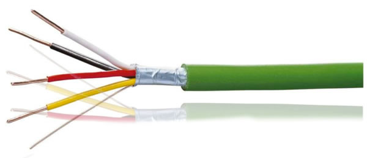
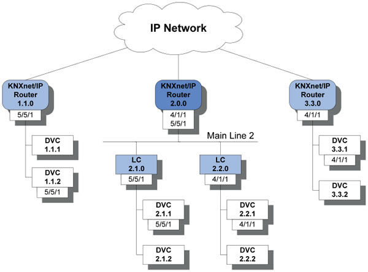
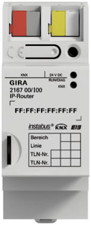

*Oggi (articolo originale pubblicato il 31 dicembre 2015 su Simmessa.com) mi sono imbattuto in un utile tutorial in inglese che spiega come funziona il protocollo KNX IP ovvero KNX over IP, per chi di voi non lo conoscesse, stiamo parlando di Konnex, ovvero uno dei più diffusi protocolli per la domotica e la home automation, trovate più info su http://knx.org comunque l'articolo che ho letto mi sembrava interessante ed ho pensato di riscriverlo qui in italiano per chi fosse curioso! Trovate l'originale su http://knxtoday.com/2014/01/3056/solutions-ip-and-knx-bringing-you-up-to-speed.html*

Mi chiedono spesso quali siano le limitazioni di KNX e se si tratta realmente di un sistema poco aggiornato, anche considerando che è stato pensato quasi 20 anni fa.
Uno dei dati più usati in questo dibattito è la velocità relativamente bassa del bus KNX, con un baud rate di 9600bps, e il fatto che moltissimi sistemi moderni possono comunicare a velocità migliaia di volte superiosi.

Quello che però a volte non viene considerato è che a 9600bps il bus può arrivare ad essere molto lungo con una topologia libera e un basso consumo dei dispositivi collegati.

Anche a questo baud rate, inoltre, il bus può supportare fino a 50 telegrammi al secondo!

Ad ogni modo, con i progressi nell’uso di KNX c’è certamente un bisogno di velocità maggiori, specialmente a livello di backbone.

Con i dispositivi di video sorveglianza e monitoring centralizzato che stanno diventando molto comuni, c’è spesso un requisito per tutti i telegrammi di essere disponibili al livello topologico più altro.

Con il cavo di bus KNX TP1, ci troviamo quindi in presenza di un collo di bottiglia, che IP può risolvere.

Per supportare questo protocollo (IP) il gruppo KNX ha sviluppato il telegramma KNX/IP, ora parte ufficiale delle specifiche KNX. Questo ci permette di usare Ethernet come un’alternativa a basso costo e banda larga al vecchio bus. Inoltre abbiamo il vantaggio che Ethernet è già presente in molti edifici residanziali e commerciali.

E’ importante capire però che se anche le reti LAN hanno molti benefici, i requisiti di avere un’infrastruttura controllata e definita necessitano di mantenere KNX TP1 come base.

*fig.1 - Il cavo KNX TP1*

## Il telegramma KNX/IP

Per permettere l’inclusione del protocollo IP come mezzo di comunicazione, il gruppo KNX ha creato un telegramma standard KNX/IP.

Questo è basato sul modello di riferimento OSI che definisce i livelli di trasporto, rete e fisico.

Per semplificare questo ci permette di definire come distribuire i telegrammi TP1 in presenza di reti IP.

Il telegramma  TP1 infatti si mantiene, ma viene usato un field aggiuntivo per definire l’azione KNXnet/IP, che può implementare uno dei seguenti servizi:

* KNXnet/IP Core
* KNXnet/IP Device Management
* **KNXnet/IP Tunnelling**
* **KNXnet/IP Routing**
* KNXnet/IP Remote Logging
* KNXnet/IP Remote Configuration and Diagnosis
* KNXnet/IP Object Server

La maggior parte di questi servizi sono auto mantenuti e non necessitano del nostro intervento, quindi per noi sarà importante concentrarci sui due evidenziati sopra, **il tunnelling e il routing.**

##KNXnet/IP Tunnelling

La modalità più semplice, nonché la principale per interfacciarsi con un sistema KNX, e permette la comunicazione punto a punto (unicast) tra un singolo device esterno e il sistema KNX, il funzionamento è del tutto analogo all’usare USB o un’interfaccia seriale!

E’ la forma di comunicazione più semplice per KNX over IP ed è facile capire perché, visto che basta puntare un device al suo indirizzo IP della scheda KNX IP.

Questo ci permette di vedere tutto il traffico del bus e comunicare direttamente con ciascun device ad esempio per la programmazione ETS.
Si usa inoltre comunemente per far dialogare i sistemi esterni con KNX.

Nota: In ETS questo metodo si definisce semplicemente come KNX/net IP

## KNXnet/IP Routing

Qui abbiamo invece un telegram basato su multicast, in questo modo un router KNX IP funzionerà da line o area coupler. Così facendo rendiamo il backbone di un sistema KNX basato su ethernet, con maggiore velocità di trasmissione e flessibilità in installazione!

Il router IP gestirà anche la tabella dei filtri per gestire il traffico (congestione, ecc) laddove necessario.

Chiaramente, trattandosi di multicast, abbiamo che per contattare più dispositivi punteremo ad un indirizzo multicast standard, in qusto modo abbiamo una comunicazione uno a molti, la KNX association ha riservato l’indirizzo di multicast 224.0.23.12 per comodità ma qualsiasi altro indirizzo può essere impiegato, basta che sia lo steso su tutti i dispositivi.

*fig.2 - Usiamo un router IP come backbone e line coupler*

Con il routing KNXnet/IP abbiamo un metodo di comunicazione che permette a tutto il traffico sul bus di venir monitorato, questo è molto utile in tutti i casi in cui i dispositivi richiedano accesso ad esempio ai sistemi di visualizzazione, però lo svantaggio è che non permette di svolgere funzioni ETS come bus monitor o il download sui device.

##Quale Hardware mi serve?

Visti i principali metodi di comunicazione, diamo uno sguardo ai prodotti che ci servono per realizzare un sistema KNX su IP.

I principali dispositivi che ci serviranno saranno le interfacce (schede di rete IP) e i router.

**Le interfacce KNX IP** supportano soltanto il metodo di comunicazione KNXnet/IP tunnelling, ciò nonostante una singola interfaccia, come la Weinzierl 730, può supportare connessioni multiple.

Proprio questa scheda infatti gestisce fino a 5 connessioni simultanee che si ottengono definendo più indirizzi fisici KNX sul device.

Ovviamente questa tecnica è molto utile quanto abbiamo istanze multiple di ETS che accedono allo stesso sistema KNX o se vogliamo usare l’interfaccia sia per una connessione ETS sia per una scheda esterna per un sistema Audio/Video, ad esempio.

**I router KNX IP**, al contrario, supportano entrambi i metodi del tunnelling e del KNXnet/IP routing, oltre a gestire le tabelle dei filtri che permettono al device di funzionare da coupler.

Di fatto alcuni router IP, come ad esempio il Gira 216700, permettono connessioni di tunnelling multiple (come le interfacce).

Il routing invece, per sua stessa natura, non ha limiti al numero di connessioni che è in grado di stabilire per via del protocollo multicast.

Alcuni device hanno inoltre time server e schede di memoria per registrare il bus.

*fig.3 - Questo è il router KNXnet / IP Gira 2167 00*

**Nota Bene:**

**E’ molto importante che ci ricordiamo di trattare questo device come line coupler, dovrà essere indirizzato correttamente nella nostra topologia di rete, e i Medium types di tutti i segmenti devono essere assegnati correttamente in ETS.**

Entrambi i device che abbiamo visto, schede e router generalmente richiedono un voltaggio superiore al (24V) bus KNX. questo di solito può essere fornito dal voltaggio aux di molte PSU KNX, ma ricordiamo che generalmente una PSU KNX offre al massimo un output di 640mA.

Per non correre rischi è meglio far funzionare ciascun device con la sua PSU dedicata, o, in alternativa, usare il protocollo Power over Ethernet (PoE) se il nostro switch lo consente, il costo dello switch potrebbe aumentare, ma l’installazione si semplifica notevolmente!

##Sicurezza e accesso remoto

Una volta che abbiamo implementato una soluzione IP è possibile configurare uno dei tipi di collegamento descritti sopra per l’accesso remoto.

Usando un’interfaccia tunnelling, possiamo stabilire una connessione diretta esterna se conosciamo l’indirizzo di WAN. Servirà una port redirection sul router per attraversare il firewall, comunque, visto che il sistema KNX non richiede una password per essere utilizzato, non è il metodo più sicuro. Questa considerazione è importante se un sistema KNX controlla un intero edificio, per evidenti ragioni di sicurezza!

Se avessimo bisogno di collegare tra loro due sistemi KNX tramite routing KNXnet/IP la VPN DEVE obbligatoriamente supportare il traffico multicast e avere questa grant dall’amministratore di sistema.

##Conclusione

Considerato tutto, non è affatto strano per noi ricevere un sacco di domande su KNX IP, anche perché non se ne parla molto nel corso di certificatione KNX.

Una volta che i termini descritti sopra sono compresi, comunque, diventa molto più facile specificare e installare i prodotti corretti. Combinando la velocità e la flessibilità del protocollo IP con l’affidabilità e semplicità del bus KNX otteniamo un sistema molto potente, flessibile e pronto al futuro.

*Articolo originale inglese scritto da Mark Warburton e disponibile all’indirizzo:
http://knxtoday.com/2014/01/3056/solutions-ip-and-knx-bringing-you-up-to-speed.html*

**Tradotto da Simmessa.**
