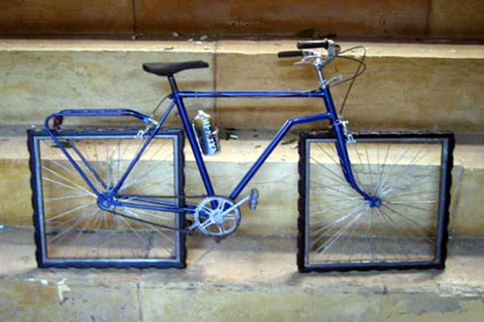

*Fa specie constatare che, questo post, scritto nel lontano 12 agosto 2014 sia, per certi versi, ancora così attuale... comunque ve lo lascio e tirate voi le conclusioni!*

Il web si sta evolvendo, quello che sappiamo fare, per il momento, è copiare, e anche male, dai nostri amici smanettoni USA.Quindi, ci accontentiamo di tecnologie obsolete.Quali tecnologie obsolete? direte voi.Praticamente tutto quello che vedete sul web italiano in questo momento lo è, centinaia di migliaia di siti che utilizzando come **database MySQL,** come linguaggio di programmazione il **PHP o ASP.**Nel web italiano, **HTML5** di solito è un banner che compare a fondo pagina, come a dire: **Ehi ma quanto siamo fighi!**

In realtà convertire un sito in HTML5 per molti developer significa questo modificare il codice da:
```
<!DOCTYPE HTML PUBLIC \"-//W3C//DTD HTML 4.01 Transitional//EN\" \"http://www.w3.org/TR/html4/loose.dtd\">
```
a:
```
<!DOCTYPE html>
```

cioè, figo, **così siamo bravi tutti.**E poi? CMS, piattaforme, l'open source che ha assolutamente spopolato negli ultimi anni ha prodotto piattaforme come **Wordpress** e **Drupal**, **MediaWiki** e **vBulletin** che ancora oggi coprono una percentuale impressionante delle installazioni totali della internet nostrana.

## Quanto obsolete?

Tanto, mi spiace dirvelo... è vero che si aggiornano ogni anno, ma questo è il periodo a cui risalgono le principali tecnologie menzionate sopra:

* **PHP** - nato nel 1994 [link wikipedia](http://en.wikipedia.org/wiki/PHP)
* **MySQL** - nato nel 1995 [link wikipedia](http://en.wikipedia.org/wiki/MySQL)
* **Drupal** - nato nel 2001 [link wikipedia](http://en.wikipedia.org/wiki/Drupal)
* **Wordpress** - nato nel 2003 [link wikipedia](http://en.wikipedia.org/wiki/WordPress) wow, non male... il più giovane ha **solo 11 anni!**

## E domani?
Domani forse avremo qualcosa di meglio, i più avventurosi si sono buttati a pesce su **jQuery** e **Ruby on Rails,** qualcuno ci prova con **nodejs**, e intanto i "grandi" siti e i network continuano a campare di codice decrepito e template rinnovati.
Oggi per questa ragione ho aperto un blog su [https://www.kickstarter.com/projects/johnonolan/ghost-just-a-blogging-platform](Ghost), un progetto nato da un kickstarter del 2013.

Mi servirà a studiare questa tecnologia e a capirne le potenzialità, non voglio rimanere indietro e invecchiare con web italiano, spero che capirete...

Seguiranno, tempo permettendo, alcune elucubrazioni sul mondo della tecnologia del web italiano, le scoperte che faccio e farò investigando **nuove tecnologie,** siano esse reali miglioramenti o semplici mode del momento...

Per il momento è tutto, preparare una piattaforma con nodejs mi ha impegnato parecchio, e ho altro lavoro da fare, ma ci sentiamo presto...

*Simmessa*

*originariamente pubblicato il 12 agosto 2014 su simmessa.com e riproposto su [medium.com](https://medium.com/@simmessa/in-italia-siamo-indietro-d32fdc126713)*