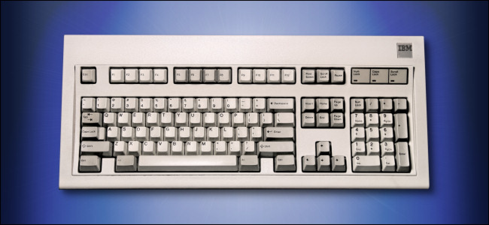

*Questo articolo e' il primo di una serie di post originali che parla delle mie esperienze con le tastiere meccaniche, buona lettura!*

Se avete usato un pc negli anni '90 sapete gia' di cosa sto parlando... Nell'epoca in cui mi sono avvicinato per la prima volta al mondo dei personal computer, quando ancora li chiamavamo PC IBM compatibili... le tastiere erano molto meglio di adesso.

E davvero mi capitava spesso di usarle, su MS-DOS 3.30, erano imprescindibili, non essendo ancora diffuse le interfacce grafiche di Windows.

Se devo essere sincero a me principalmente servivano ad editare due file: AUTOEXEC.BAT e CONFIG.SYS... ma quando hai un solo modo di interagire con il tuo PC, di certo non dovrebbe essere un'agonia, questo e' un fatto.

Se vi suono come un vecchio che si lamenta dei bei tempi andati, beh, probabilmente lo sono... fatto sta' che a quei tempi tastiera e mouse (incredibile a dirsi, proprio in quest'ordine!) erano i protagonisti dell'uso quotidiano del PC.

Lanciare un gioco significava lanciare comandi da un terminale, prima di tutto, e in alcuni casi la tastiera era proprio il centro dell'interazione con la UI del gioco stesso.

La prima tastiera che mi e' capitato di usare con il PC non era male, nel senso che la  qualita' media era piu' che accettabile, purtroppo piu' tardi negli anni la qualita' media di tastiera e mouse declino' rapidamente e capitava spesso di ricevere, con l'acquisto di un PC nuovo, oggetti che sembravano destinati alla spazzatura. Ovviamente vi parlo sempre dei classici computer "assemblati" da qualche venditore di componenti, ma nemmeno i marchi, come Compaq, HP, Acer e Dell erano completamente immuni a questo fenomeno, complice la necessita' di tagliare i costi su un segmento che assicurava guadagni sempre piu' risicati.

Quindi molti di noi si trovavano a sostituire questi disastrosi accessori con qualcosa di decente fatto da Logitech ed ecco che tutto tornava ad essere normale.

Arriviamo a ieri, tutti noi o quasi ci siamo trovati tra le mani un portatile, con la sua economicissima tastiera ad isola, switch a farfalla, e se va bene nel giro di qualche anno tasti scoloriti che registrano la pressione l'80% delle volte. Un esempio su tutti quelle tastiere da incubo dei portatili Mac di penultima generazione, dimostrazione del fatto che quando una grande azienda (Apple, in questo caso) vuole risparmiare a danno dei consumatori ci riesce sempre benissimo.

## Tastiere a membrana
C'e' un fattore che quasi tutte le tastiere economiche "di una volta" hanno in comune: **non** sono tastiere meccaniche, a parte rarissime eccezioni (come la [Model M](https://en.wikipedia.org/wiki/Model_M_keyboard) di IBM). La maggior parte delle tastiere che abbiamo utilizzato con il PC sfruttavano infatti la costruzione basata sull'utilizzo di membrane di gomma.

Le tastiere basate su questa membrana di gomma sono infatti tra le piu' diffuse, almeno fino ad oggi, anche perche' sono tra le piu' economiche da produrre. Il loro meccanismo e' basato su una singola membrana gommosa larga quanto tutta la tastiera che e' la parte che oppone resistenza alla pressione di ciascun tasto. Come si dice una foto vale mille parole per cui:

Quindi, riassumiamo, il nostro dito preme su un tasto che e' montato sulla sommita' di un cilindretto cavo di gomma, superando una certa forza il cilindro di gomma non oppone piu' una resistenza sufficiente per cui il tasto arriva a fine corsa dove fa contatto con un sensore che ne registra la pressione per comunicarla al controller della tastiera e infine al PC.

Personalmente non ho nulla contro le tastiere a membrana, anzi, una tastiera a membrana, se ben costruita, puo' essere anche molto piacevole da utilizzare, risultando, a mio avviso, la tipologia piu' "tattile" in assoluto.

Questo perche' a me piace che ciascun tasto opponga una certa resistenza alla pressione, questa resistenza mi serve ad avere la certezza di averlo premuto prima di poter proseguire con il resto della digitazione.

Per molti altri, al contrario, questo fatto della resistenza e' **estremamente spiacevole**, una sorta di impedimento.

Alla fine, dipende tutto dal tocco di ciascuno, visto che non siamo tutti uguali. C'e' chi ha le dita leggere e preferisce "volare" su una tastiera che registra la pressione al minimo tocco, c'e' chi ha invece le mani pesanti e pigia i tasti come se dovesse martellare talpe sul whack-a-mole...

## Tastiere da portatile e a farfalla

Un'altra tipologia di tastiere parecchio diffusa e' quella che troviamo sulla maggioranza dei portatili, con tastiere ad isola. La tipologia costruttiva e' quella degli *scissors switch* (a forbice), con tutte le varianti del caso ovvero i "fantasmagorici" switch butterfly (a farfalla) brevettati da Apple.

Anche qui, se va tutto bene ci sono soluzioni decenti, ma quando i produttori decidono di risparmiare arrivano le (brutte) sorprese, soprattutto in termini di durata nel tempo.

*Switch a forbice o a farfalla, non esattamente il massimo*

Su queste tastiere i tasti hanno una corsa molto limitata, complici gli spazi esigui di un portatile, e la soddisfazione durante la digitazione puo' risentirne parecchio, ma se le tastiere a membrana generalmente facilitano chi ha un tocco pesante quelle a forbice/farfalla sembrano piu' indicate per chi ha dita leggere.

## Tastiere meccaniche? Si, grazie

Purtroppo, spesso non abbiamo la possibilita' di scegliere la tastiera piu' adatta alle nostre esigenze, e ci affidiamo a quello che "passa in convento", a maggior ragione se si tratta di un portatile. Fortunatamente, esiste una tipologia di tastiere completamente diversa da quelle analizzate sino ad ora, ovvero le famose "tastiere meccaniche", ma perche' si chiamano cosi'?

Le tastiere meccaniche prendono il nome da un particolare tipo di switch utilizzato per ciascun tasto, che e' appunto di tipo "meccanico".

Il funzionamento di questi switch e' infatti diverso da quello degli switch a membrana o a forbice, vediamone alcuni da vicino:

Come potete vedere, questi sono i tre fondamentali switch meccanici visti nel dettaglio del loro funzionamento, e sono contraddistinti da 3 colori diversi, in base al funzionamento interno.

Il colore di riferimento, anche se con eventuali variazioni, e' dovuto al fatto che questi sono i colori del principale produttore di switch meccanici, ovvero [Cherry Mx](https://www.cherrymx.de/en).

Vediamo allora le tre principali tipologie di switch per tastiera meccanica

### Gli switch "rossi"

Questi switch sono di tipo lineare, ovvero, quando una forza viene impressa sullo switch, si comportano linearmente. In breve, significa che la pressione di attuazione, ovvero la pressione minima con cui il tasto registra un segnale, e' piuttosto bassa, e questo rende gli switch rossi particolarmente indicati per due tipologie di utilizzatori:

- **i gamer:** che necessitano dei tempi di risposta piu' rapidi in assoluto
- **i typer "leggeri":** dato che questi switch richiedono di una pressione minima per essere attivati

### Gli switch "marroni"

Questi switch sono di tipo tattile, la differenza tra brown e red puo' sembrare minima dall'animazione che avete visto poco sopra, ma in realta' il feeling e' molto diverso. Uno switch tattile, infatti, non ha un comportamento lineare, ma registra la pressione solo quando questa supera una certa soglia.

I brown sono forse gli switch che assomigliano di piu' a quelli delle tastiere a membrana, oppongono una resistenza sensibile, anche se mediamente inferiore, e danno una feeling ideale per la digitazione, quando questa avviene con un tocco medio / pesante.

Per questa ragione sono quelli piu' indicati per chi si trova, per lavoro o per altra ragione, a dover scrivere molto alla tastiera del suo computer.

*Se siete programmatori o per un normale lavoro da ufficio, gli switch brown sono tra quelli piu' indicati per voi*

### Gli switch blu

I blue sono senza dubbio gli switch meccanici piu' riconoscibili del trio, questo perche' hanno una caratteristica unica: se ci fate caso c'e' una parte di switch separata dal corpo blu a contatto con il tasto.

Questa parte dello switch durante la pressione va a fare contatto con il fondo producendo un tipico suono "click" che e' la caratteristica distintiva dei blue.

Gli switch di questo tipo sono gli unici che producono questo suono quando il tasto viene effettivamente premuto, restituendo all'utente un ulteriore feedback uditivo dell'avvenuta pressione.

Sembra una piccola differenza, ma vi assicuro che il feeling e' unico e molto diverso da quello di tastiere dotate di red o brown.

I blue sono gli switch che molti da sempre collegano alle tastiere meccaniche, sapete perche'?

Perche' la tastiera meccanica piu' famosa di tutti i tempi, ovvero il modello M fabbricato da IBM a partire dal 1985 e' dotato proprio di cherry mx blue.

La caratteristica principale degli switch blu, quindi, e' - passatemi il termine - la *cliccosita'* che producono quando li premiamo. Dal punto di vista del feeling, gli switch blu sono ideali per chi ama un ulteriore feedback e vuole essere certo di aver premuto il tasto, perfetto per chi possiede un tocco pesante e non frequenta ambienti troppo affolati.

La principale controindicazione dei blu, a mio avviso, e' la rumorosita' durante l'utilizzo, questi switch sono assolutamente da sconsigliare per chi si trova a lavorare in un ufficio con dei colleghi, ad esempio in un open space, e di questi giorni, chi non lavora in un open space?

Certo, sempre per rimanere (pandemicamente) attuali, le tastiere con cherry blue non hanno controindicazioni per chi lavora da casa e ha il lusso di non avere vicino altre persone che potrebbero esserne disturbate.

## Altre tipologie di switch

Come avrete gia' notato, il bello degli switch meccanici e' che ci sono grandi possibilita' di personalizzazione della tastiera, non male per un accessorio che da sempre consideravamo "standard".

In particolare, non ci fermiamo ai soli tre tipi di switch visti qui sopra, esistono infatti moltissimi produttori e, data la recente domanda del mercato, centinaia se non migliaia di variazioni dei tre switch classici red, brown & blue.

Vederli tutti e' semplicemente impossibile per cui cercheremo di parlare di quelli piu' interessanti e/o originali.

### Silent switch

Il suono delle tastiere meccaniche senza dubbio richiede un capitolo speciale di questa serie di articoli, perche' per molti, incluso chi scrive, il sound di una tastiera meccanica e' una componente fondamentale nella scelta.

In generale, rispetto alle normali tastiere a membrana considerate come la tipologia di tastiera piu' diffusa e comune in un ufficio, le tastiere meccaniche sono mediamente piu' rumorose.

Questa loro caratteristica, che deriva direttamente dagli switch utilizzati, ha portato i produttori ad ideare una prima variante, sono gli switch cosiddetti "silent".

E' stata proprio la Cherry MX [nel 2015](https://www.anandtech.com/show/9498/corsair-and-cherry-introduce-new-quieter-mechanical-keyboard-switches) la prima ad introdurre questa nuova tipologia di switch silenzati con i suoi silent MX, offerti nelle colorazioni standard, ovvero red, brown e black (una variante lineare dotata di una molla che richiede una forza di attuazione superiore rispetto ai red). Per ovvie ragioni non esiste una versione silent dei blue.

Le caratteristiche sono fondamentalmente le stesse dei corrispettivi "non silent", ma internamente ci sono alcuni accorgimenti utili a ridurre in modo significativo il rumore. Non e' questa la sede per parlare delle tecniche costruttive in dettaglio ma esistono numerosi articoli dedicati all'argomento ([un esempio](https://switchandclick.com/2020/06/20/are-silent-switches-worth-it/#:~:text=Silent%20Switch%20Construction&text=The%20rubber%20limits%20the%20amount,more%20rubbery%20and%20mushy%20response.))

Attenzione pero', il rumore di una tastiera non dipende dal solo switch, andrebbero considerati anche altri componenti tra cui, fondamentale, lo chassis che funge da vera e propria cassa di risonanza.

Gli switch silent solitamente sono piu' cari delle versioni "standard", esistono pero' alcuni accorgimenti, tra cui principalmente l'utilizzo di *o-ring*, per silenziare gli switch classici che con pochi euro permettono di raggiungere risultati interessanti.

### Low profile switch

Altra variante molto diffusa dei singoli switch e' quella dei *low profile* che sono sostanzialmente delle versioni ridotte degli switch standard.

I low profile nascono come variante per due ragioni storiche:

- Permettere un tocco piu' veloce, avendo una corsa minore dello switch
- Rendere possibile la costruzione di tastiere meno alte, quindi piu' ergonomiche e trasportabili

Secondo me la reale innovazione introdotta dagli switch low profile e' quella di avvicinare anche i portatili/laptop ad avere tastiere meccaniche.

Probabilmente un giorno ci arriveremo, ma per il momento gli unici laptop in commercio dotati di tastiera meccanica sono tutti modelli dedicati al mondo del gaming... *E a noi computer scientist? chi ci pensa?*

Credo comunque che presto arriveranno delle novita' in questo senso e, se succedera', lo dovremo alle innovazioni degli switch meccanici low profile.

*~ Continua ~*

*Spero vi sia piaciuto l'articolo! ci ritroviamo presto con la seconda parte*
